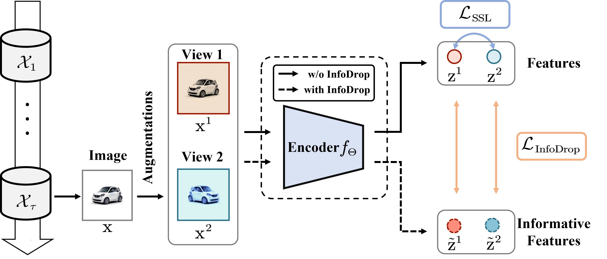
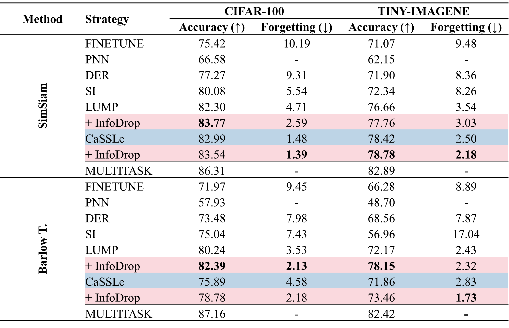

# 📖 InfoUCL: Learning Informative Representations for Unsupervised Continual Learning

This is the *Pytorch Implementation* for the paper:

> **InfoUCL: Learning Informative Representations for Unsupervised Continual Learning** <br>
> Liang Zhang, Jiangwei Zhao, Qingbo Wu, Lili Pan, Hongliang Li <br>
> IEEE Transactions on Multimedia (submitted)

> **Abstract**: Recently, there has been a growing interest in unsupervised continual learning (UCL) as a new direction of continual learning (CL). However, most existing UCL methods have only paid attention to transferring CL strategies from supervised continual learning (SCL) to UCL, without considering whether the learned image feature suits UCL. This work highlights the problem of texture bias that has been previously ignored in existing UCL methods. To address this problem, we propose a new framework called InfoUCL, which integrates InfoDrop into UCL to encourage continual learners to learn informative image features and discard less informative ones. Our proposed InfoUCL framework can be easily combinable with most existing UCL strategies. Extensive experiments on various benchmarks have demonstrated that our InfoUCL framework achieves higher classification accuracy and superior robustness to catastrophic forgetting.

<div align=center>

</div>

## 🔧 Dependencies and Installation

**Dependencies**

- Python >= 3.7.13 (Recommend to use [Anaconda](https://www.anaconda.com/download/#linux) or [Miniconda](https://docs.conda.io/en/latest/miniconda.html))
- [PyTorch &gt;= 1.9.1](https://pytorch.org/)
- Option: Linux(Ubuntu 20.04.3)

**Installation**

First, you can clone this repo using the command:

```shell
git clone https://github.com/learninginvision/InfoUCL
```

Then, you can create a virtual environment using conda, as follows:

```shell
conda env create -f environment.yaml
```

## 🗺 Dataset preparation

We provide source about the datasets we use in our experiment as below:

| Dataset   | Dataset file                                                 |
| --------- | ------------------------------------------------------------ |
| Split CIFAR-10  | [CIFAR-10](http://www.cs.toronto.edu/~kriz/cifar-10-python.tar.gz)          |
| Split CIFAR-100  | [CIFAR-100](http://www.cs.toronto.edu/~kriz/cifar-100-python.tar.gz) |
| Split Tiny-ImageNet | [Tiny-Imagenet](https://drive.google.com/file/d/1Sy3ScMBr0F4se8VZ6TAwDYF-nNGAAdxj/view) |
| iDigits  | [MNIST, SVHN, MNIST-M and SYN](https://drive.google.com/file/d/1WOei2UJzOnjoksrsyT5VfUGHgO67ROYZ/view?usp=sharing) |
| Split ColoredMNIST | [ColoredMNIST](https://github.com/mkmenta/ColorMNIST/blob/master/ColorMNIST.py) |

In addition, if you do not want to modify the code, please store the dataset in the path: `../dataset/` and make sure that the folder structure under this path is as follows:

```
├── MNIST
│   └── raw
├── CIFAR10
│   └── cifar-10-batches-py
├── CIFAR100
│   └── cifar-100-python
├── IDIGITS
│   ├── test
│   └── train
└── TINYIMG
    └── processed
```

## 💻 Training

Run the following command to train and evaluate a model sequentially:

```
CUDA_VISIBLE_DEVICES={GPU_IDX} python train.py --log_dir {LOG_PATH} -c {CONFIG_PATH}
```

Command-line arguments are as follows:

- `{GPU_IDX}`: The index of GPU which you want to adopt. (default: `0`)
- `{LOG_PATH}`: The path to save the log file and model checkpoints. (default: `./logs/`)
- `{CONFIG_PATH}`: The path to the configuration file. (default: `./configs/simsiam_c10_cassle.yaml`)

Additionally, you can change the hyperparameters in the configuration file `./configs/*.yaml` to train the model.
After training, you can get model checkpoints in the folder `./logs/exp_name`, where `exp_name` is the name of the experiment (generated automatically), and the training log will be saved in the folder `./logs/exp_name/`.

## 📊 Evaluation

After training, you can get model checkpoints in the folder `./logs/exp_name`, where `exp_name` is the name of the experiment. 
Then, you can re-evaluate the model using the command:

```
CUDA_VISIBLE_DEVICES={GPU_IDX} python test.py --log_dir {EXP_PATH}
```

`{EXP_PATH}` is the path to the experiment folder. Additionally, the result will be saved in the folder `{EXP_PATH} `.

## 📈 Results


<div align="center">


*Results on SPLIT CIFAR-100 and SPLIT TINY-IMAGENET in Task-incremental setting.*
</div>


## 📜 Acknowledgments

This code is built upon [divyam3897/UCL](https://github.com/divyam3897/UCL/), and refers to the following four projects:

[1] [InfoDrop](https://github.com/bfshi/InfoDrop)

[2] [mammoth](https://github.com/aimagelab/mammoth)

[3] [cassle](https://github.com/DonkeyShot21/cassle)

[4] [lightly](https://github.com/lightly-ai/lightly)

We thank the authors for releasing their code. 